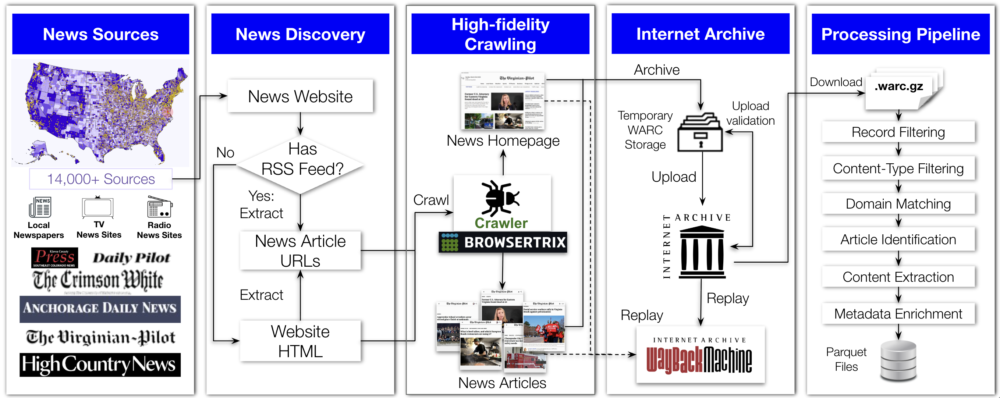

# USLNDA: US Local News Data Archive

## 1. About USLNDA

USLNDA is **the first public large-scale ongoing longitudinal US local news repository**, which is a comprehensive archive of US local news content, publicly available at the [Internet Archive](https://archive.org/details/us-local-news-data). This project addresses the critical decline in local journalism by preserving high-fidelity web content from over **14,000 US local newspapers, TV, and radio stations across all 50 states**. 
- **Complete Web Preservation**: Full WARC format preservation including HTML, CSS, JavaScript, and dynamic content, not just plaintext
- **Comprehensive Local Coverage**: 14,000+ outlets across all 50 states vs. competing datasets with limited geographic coverage
- **Ongoing Longitudinal Data**: Daily crawls supporting continuous longitudinal analysis vs. fixed-period datasets
- **High-Fidelity Capture**: Browsertrix headless browser execution captures dynamic content and JavaScript-rendered elements missed by traditional crawlers
- **Public Access**: Free and publicly available at Internet Archive vs. restricted commercial datasets
- **Rich Geographic Metadata**: County-level and FIPS code information enabling fine-grained spatial analysis
- **Browsable Archive**: Full pages accessible via Internet Archive's Wayback Machine alongside structured dataset

To cite, kindly use:
```bibtex
@inproceedings{gangani_alam_nwala_2026uslnda,
  title={USLNDA: US Local News Data Archive},
  author={Ariyarathne, Gangani and Alam, Sawood and Nwala, Alexander C.},
  year={2026}
}
```



---

## 2. Dataset

### 2.1. Access Dataset

1. USLNDA: https://archive.org/details/us-local-news-data
2. Processed USLNDA 6-month snapshot:

### 2.2. USLNDA workflow 

The USLNDA pipeline consists of three main stages:
- **Build Phase** (`build/` directory): Daily crawls using Browsertrix, WARC file generation, and upload to Internet Archive
- **Process Phase** (`process/` directory): Download WARC files and extract/analyze news article data with geographic metadata

#### 2.2.1. Daily Crawling (Build Phase)
- Browsertrix-based headless browser crawler discovers and archives web content
- Prioritizes RSS feeds for structured article links; crawls homepages for sites without RSS
- Extracts up to 5 articles per website per day
- Generates WARC files with naming convention: `USLNDA-ST-YYYYMMDD-HHMMSS_ABCD.warc.gz`
  - ST: two-character state abbreviation (e.g., VA)
  - YYYYMMDD-HHMMSS: UTC date/time of crawl
  - ABCD: zero-padded sequence number (file rollover at 10GB limit)

#### 2.2.2. Upload and Preservation
- Parallel WARC upload to Internet Archive collection ([us-local-news-data](https://archive.org/details/us-local-news-data))
- MD5 checksum verification and deduplication
- Retry mechanisms for failed uploads (3+ attempts)
- Continuous validation of recent uploads (past 3 days)
- Files accessible via Internet Archive's Wayback Machine and API

#### 2.2.3. Processing and Extraction (Process Phase)
A multi-stage pipeline extracts structured article data from WARC files:
1. **Record Filtering**: Process only WARC "response" records
2. **Content-Type Filtering**: Retain HTML resources only, discard images/scripts/CSS
3. **Domain Matching**: Verify URLs belong to covered local news websites
4. **Article Identification**: Apply heuristics and StorySniffer to distinguish articles from directory pages
5. **Content Extraction**: Extract titles and main text using HTML parsing techniques
6. **Metadata Enrichment**: Augment with source media type, home county/state, and FIPS code
7. **Output**: Parquet files partitioned by state, county, and date; summary CSVs with statistics


---

## 3. Installation & Requirements

### 3.1 System Requirements
- Python 3.x
- Internet Archive CLI tool (`ia` command)
- For Browsertrix crawling: Browsertrix installed and accessible
  
### 3.2 Python Dependencies

Install all required packages:
```bash
pip install feedparser requests beautifulsoup4 storysniffer tqdm internetarchive pandas warcio
```

### 3.3 Environment Variables
The following environment variables can be used to configure scripts:

**Email Configuration (for notifications):**
- `EMAIL_USER`: Gmail account for sending alerts
- `EMAIL_PASS`: Gmail app-specific password (not regular password)
- `EMAIL_TO`: Recipient email address

**Internet Archive Upload:**
- `BASE_DIR`: Base directory for data collection (default: `/app1/ia-collection`)
- `DAYS_BACK`: Number of days to look back for validation (default: `3`)
- `MAX_WORKERS`: Number of parallel workers (default: `8`)

### 3.4 Internet Archive Authentication
Set up Internet Archive credentials:
```bash
ia configure
```
This will prompt for your Internet Archive username and password.

---

## 4. Implementation

### 4.2. Build Scripts

#### 4.2.1. `browsertrix-crawler.py`

`browsertrix-crawler.py` is the primary crawling component of the USLNDA pipeline.  
It performs continuous large-scale crawling of local news websites and generates high-fidelity WARC archives suitable for long-term preservation and downstream processing.

<details>
<summary><strong>Features</strong></summary>

- RSS feed parsing and URL extraction
- Homepage crawling for sites without RSS feeds
- Story detection using StorySniffer
- Concurrent crawling with progress tracking
- High-fidelity Browsertrix rendering
- WARC generation for preservation
- Email alerts for completion and failures
- Rotating log files
- Configurable time limits and worker processes
- Kubernetes/HPC friendly execution

</details>

<details>
<summary><strong>Parameters</strong></summary>

| Parameter | Description |
|---|---|
| `--input` | Path to publication JSON input file (default: `data.json`) |
| `--sleep` | Time between crawl iterations in seconds (default: `3600`) |
| `--max_articles` | Maximum articles to crawl per publication (default: `5`) |
| `--log` | Log file path (default: `/app1/ia-collection/news_scraper.log`) |
| `--log_level` | Logging level (default: `INFO`) |
| `--mediatype` | Internet Archive media type (default: `web`) |
| `--collection` | Internet Archive collection name (default: `us-local-news-data`) |
| `--item_identifier` | Prefix for Internet Archive item identifiers (default: `USLNDA`) |
| `--time_limit` | Time limit for archiving subprocess |
| `--time_per_url` | Timeout per article URL in seconds (default: `120`) |
| `--collection_directory` | Directory for storing WARC files (default: `/app1/ia-collection`) |
| `--tmp_directory` | Temporary working directory (default: `/app1`) |
| `--delete_warc` | Delete WARC files after upload (default: `True`) |
| `--start` | Starting state index for processing (default: `0`) |
| `--end` | Ending state index (exclusive) |
| `--once_per_day` | Run crawler once daily for all states (default: `True`) |
| `--workers` | Parallel crawling workers (default: `5`) |
| `--rolloverSize` | WARC rollover size in bytes (default: `10000000000`) |
| `--hung_threshold` | Seconds without logs before forced exit/alert (default: `7200`) |

</details>

<details>
<summary><strong>Example Usage</strong></summary>

```bash
python build/browsertrix-crawler.py \
    --input publications.json \
    --workers 8 \
    --max_articles 10 \
    --log crawler.log
```

</details>


#### 4.2.2. `upload_validator.py`

`upload_validator.py` performs post-upload validation for archived WARC files stored on the Internet Archive. It continuously checks recently uploaded files, verifies integrity using MD5 checksums, identifies missing uploads, and automatically retries failed uploads when necessary.

<details>
<summary><strong>Features</strong></summary>

- MD5 checksum validation
- Detection of missing or incomplete uploads
- Parallel upload validation
- Automatic retry handling
- Exponential backoff retry logic
- Email notifications for failures
- Continuous daily validation workflow
- Sleeps until next midnight after completion

</details>

<details>
<summary><strong>Configuration (Environment Variables)</strong></summary>

| Variable | Description |
|---|---|
| `EMAIL_USER` | Gmail account used for sending alerts |
| `EMAIL_PASS` | Gmail app password |
| `EMAIL_TO` | Recipient email address for notifications |
| `BASE_DIR` | Base directory for WARC collection data (default: `/app1/ia-collection`) |
| `DAYS_BACK` | Number of previous days to validate (default: `3`) |
| `MAX_WORKERS` | Number of parallel validation/upload workers (default: `8`) |

</details>

<details>
<summary><strong>Retry Behavior</strong></summary>

- Maximum retry attempts: `3`
- Delay between retries: `5 minutes`
- Automatic exponential backoff for repeated failures

</details>

<details>
<summary><strong>Example Usage</strong></summary>

```bash
export EMAIL_USER="your-email@gmail.com"
export EMAIL_PASS="your-app-password"
export EMAIL_TO="recipient@example.com"
export BASE_DIR="/path/to/ia-collection"

python build/upload_validator.py
```

</details>
  
#### 4.2.3. `uploader.py`

`uploader.py` uploads WARC files to the Internet Archive using parallel worker processes. It supports retry handling, optional SSD staging, upload cleanup, and logging for large-scale archival workflows.

<details>
<summary><strong>Parameters</strong></summary>

| Parameter | Description |
|---|---|
| `--collection` | Internet Archive collection name (default: `us-local-news-data`) |
| `--collection_directory` | Directory containing dated collection folders (default: `/app1/ia-collection`) |
| `--uploader` | Uploader identity |
| `--mediatype` | Media type for Internet Archive upload (default: `web`) |
| `--delete_uploaded_warc` | Delete WARC file after successful upload |
| `--max_workers` | Number of parallel worker processes (default: `10`) |
| `--log` | Path to log file (default: `/app1/news_scraper.log`) |
| `--log_level` | Logging level (default: `INFO`) |
| `--max_retries` | Maximum retries per file (default: `6`) |
| `--backoff_base` | Base sleep time for exponential backoff (default: `2.0`) |
| `--stage_to_local` | Copy files to local SSD before upload |
| `--local_stage_path` | Local SSD staging directory (default: `/tmp/ia_staging`) |
| `--prefix` | Prefix for dated folder names (default: `USLNDA`) |

</details>

<details>
<summary><strong>Example Usage</strong></summary>

```bash
python build/uploader.py \
    --max_workers 16 \
    --stage_to_local \
    --local_stage_path /ssd/staging \
    --collection us-local-news-data
```

</details>

---

### 4.3. Process Scripts

#### 4.3.1. `download_uslnda.py`

`download_uslnda.py` downloads archived USLNDA WARC files from the Internet Archive into a local storage directory for downstream processing and analysis. It supports retry handling, progress logging, configurable worker pools, and optional forced redownloads.

<details>
<summary><strong>Features</strong></summary>

- Downloads only missing files
- Parallel downloading with configurable workers
- Retry handling for failed downloads
- Progress logging
- Configurable identifier ranges
- Optional force redownload
- Scalable for HPC/distributed environments

</details>

<details>
<summary><strong>Parameters</strong></summary>

| Parameter | Description |
|---|---|
| `--year` | Target year in `YYYY` format |
| `--month` | Target month in `MM` format |
| `--download_root` | Root directory for downloaded files |
| `--ia_bin` | Path to Internet Archive CLI binary (default: `ia`) |
| `--workers` | Number of parallel download workers (default: `4`) |
| `--retries` | Retry attempts for failed downloads (default: `3`) |
| `--retry_sleep` | Sleep duration between retries in seconds (default: `5`) |
| `--progress_log_root` | Directory for progress logs (default: `download_logs`) |
| `--start_identifier` | Starting identifier for download range |
| `--end_identifier` | Ending identifier for download range |
| `--max_identifiers` | Maximum identifiers to process |
| `--force` | Redownload files even if already present locally |

</details>

<details>
<summary><strong>Example Usage</strong></summary>

```bash
python process/download_uslnda.py \
    --year 2023 \
    --month 01 \
    --download_root /data/downloads \
    --workers 8 \
    --start_identifier uslnda-001 \
    --end_identifier uslnda-050
```

</details>
  
#### 4.3.2. `process_uslnda.py`

`process_uslnda.py` is the primary data extraction and processing component of the USLNDA pipeline. It reads downloaded WARC files, filters valid HTML news content, identifies likely news articles using heuristics and StorySniffer, extracts article text and metadata, and generates structured Parquet datasets partitioned by geographic and temporal attributes.

</details>


<details>
<summary><strong>Features</strong></summary>

- WARC record filtering (`response` records only)
- HTML content filtering
- Local news domain matching
- Article identification using StorySniffer and heuristics
- HTML parsing for title and content extraction
- Geographic enrichment with county/state/FIPS metadata
- Parquet output partitioned by state, county, and date
- Summary CSV generation
- Parallel processing using `ProcessPoolExecutor`
- Scalable processing for large WARC collections

</details>

<details>
<summary><strong>Parameters</strong></summary>

| Parameter | Description |
|---|---|
| `--year` | Target year in `YYYY` format |
| `--month` | Target month in `MM` format |
| `--site_csv` | CSV file containing publication/site metadata |
| `--download_root` | Root directory containing downloaded WARC files (default: `warc_cache`) |
| `--output_root` | Output directory for Parquet datasets (default: `article_parquet`) |
| `--summary_csv` | Output path for summary statistics CSV (default: `results/month_summary.csv`) |
| `--buffer_limit` | Buffer size for batch processing (default: `200`) |
| `--report_every_records` | Progress reporting interval for processed records (default: `2500`) |
| `--report_every_html` | Progress reporting interval for HTML pages (default: `500`) |
| `--workers` | Number of parallel WARC workers per identifier (default: `4`) |
| `--start_identifier` | Starting identifier for processing range |
| `--end_identifier` | Ending identifier for processing range |
| `--max_identifiers` | Maximum identifiers to process |

</details>

<details>
<summary><strong>Example Usage</strong></summary>

```bash
python process/process_uslnda.py \
    --year 2023 \
    --month 01 \
    --site_csv sites.csv \
    --download_root /data/downloads \
    --output_root /data/output \
    --workers 8
```

</details>

---

## 5. Use Cases

<details>
<summary>1. Analyzing News Deserts and Coverage Gaps</summary>

USLNDA enables researchers to identify regions with limited local news coverage and measure disparities in news production across counties. Its longitudinal structure supports tracking the emergence, persistence, and evolution of news deserts over time.

</details>

<details>
<summary>2. Dynamics of Local News Production</summary>

The dataset supports analysis of temporal patterns in local journalism by capturing daily snapshots of news activity across thousands of outlets. Researchers can study how local media responds to elections, disasters, public health crises, and other major events.

</details>

<details>
<summary>3. Studying Regional Differences in Local News</summary>

USLNDA allows comparative analysis of how similar events are covered across different geographic regions. Researchers can investigate regional framing differences, local biases, and variations in information dissemination across communities.

</details>

<details>
<summary>4. Studying the Structure of News Content</summary>

Because USLNDA preserves full web content in WARC format, researchers can analyze webpage structure, embedded media, advertisements, and layout elements. This supports studies on how presentation and design practices influence audience engagement and perception.

</details>

<details>
<summary>5. General Applications Beyond Journalism</summary>

USLNDA supports broader research applications in natural language processing, information retrieval, web archiving, and computational social science. The combination of raw WARC files and structured article datasets provides a valuable resource for developing and evaluating new methods.

</details>

## Authors

- **Gangani Ariyarathne** - William & Mary (gchewababarand@wm.edu)
- **Sawood Alam** - Internet Archive (sawood@archive.org)
- **Alexander C. Nwala** - William & Mary (acnwala@wm.edu)

