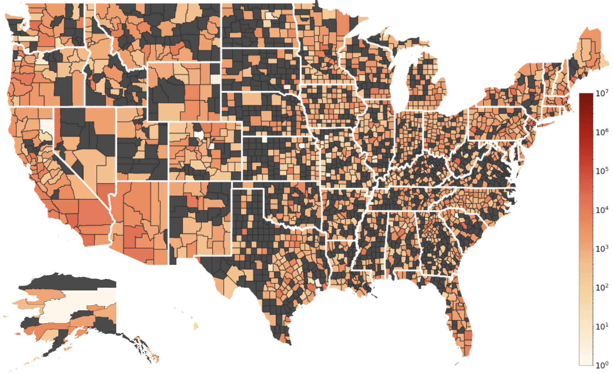

# USLNDA: US Local News Data Archive

## 1. About USLNDA

USLNDA is **the first public large-scale ongoing longitudinal US local news repository**, which is a comprehensive archive of US local news content, publicly available at the [Internet Archive](https://archive.org/details/us-local-news-data). This project addresses the critical decline in local journalism by preserving high-fidelity web content from over **14,000 US local newspapers, TV, and radio stations across all 50 states**. 

The archive captures not just text, but complete web resources including HTML, CSS, JavaScript, images, and dynamically rendered content—preserving news articles as they appear to readers. With daily crawls and county-level geographic metadata, USLNDA enables researchers to study news deserts, track coverage gaps, analyze temporal dynamics of local news production, and conduct large-scale computational journalism research.

To cite, kindly use:
```bibtex
@inproceedings{gangani_alam_nwala_2026uslnda,
  title={USLNDA: US Local News Data Archive},
  author={Ariyarathne, Gangani and Alam, Sawood and Nwala, Alexander C.},
  year={2026}
}
```


## 2. Dataset

### 2.1. Access Dataset

1. USLNDA: https://archive.org/details/us-local-news-data
2. Processed USLNDA 6-month snapshot:

### 2.2. Dataset Overview

**Scale & Coverage:**
- 14,000+ local news sources (newspapers, TV, radio stations)
- All 50 US states
- 363+ million WARC records (6-month analysis)
- 3.8+ million validated news articles
- Daily ongoing crawls (up to 5 articles per source per day)

**Data Format:**
- WARC (Web ARChive) format for full web preservation
- Includes HTML, CSS, JavaScript, images, and dynamically rendered content
- Processed USLNDA 6-month snapshot with enriched with metadata: temporal and county-level geographic information including state, county, and FIPS codes



## 4. USLNDA workflow 

1. **Build Phase** (`build/` directory): Daily crawls using Browsertrix, WARC file generation, and upload to Internet Archive
2. **Process Phase** (`process/` directory): Download WARC files and extract/analyze news article data with geographic metadata

### 4.1. Configuration, Requirements and Dependencies

#### 4.1.1 System Requirements
- Python 3.x
- Internet Archive CLI tool (`ia` command)
- For Browsertrix crawling: Browsertrix installed and accessible
  
#### 4.1.2 Python Dependencies

Install all required packages:
```bash
pip install feedparser requests beautifulsoup4 storysniffer tqdm internetarchive pandas warcio
```

#### 4.1.3 Environment Variables
The following environment variables can be used to configure scripts:

**Email Configuration (for notifications):**
- `EMAIL_USER`: Gmail account for sending alerts
- `EMAIL_PASS`: Gmail app-specific password (not regular password)
- `EMAIL_TO`: Recipient email address

**Internet Archive Upload:**
- `BASE_DIR`: Base directory for data collection (default: `/app1/ia-collection`)
- `DAYS_BACK`: Number of days to look back for validation (default: `3`)
- `MAX_WORKERS`: Number of parallel workers (default: `8`)

#### 4.1.4 Internet Archive Authentication
Set up Internet Archive credentials:
```bash
ia configure
```
This will prompt for your Internet Archive username and password.

### 4.2. Build Scripts

#### 4.2.1. browsertrix-crawler.py
Daily high-fidelity web crawler using Browsertrix that crawls local news websites, extracts article URLs from RSS feeds and homepages, detects news content using heuristics, and generates WARC archives for preservation at the Internet Archive.

<details>
<summary>Features</summary>
- RSS feed parsing and URL extraction
- Story detection using StorySniffer
- Concurrent crawling with progress tracking
- Email alerts for completion/failures
- Rotating log files
- Configurable time limits and worker processes
</details>

<details>
<summary>Parameters</summary>
- `--input` (default: `data.json`): Path to JSON input file with publication data
- `--sleep` (default: `3600`): Time between iterations in seconds
- `--max_articles` (default: `5`): Maximum number of articles to scrape per publication
- `--log` (default: `/app1/ia-collection/news_scraper.log`): Path to log file
- `--log_level` (default: `INFO`): Logging level (DEBUG, INFO, WARNING, ERROR, CRITICAL)
- `--mediatype` (default: `web`): Media type for Internet Archive upload
- `--collection` (default: `us-local-news-data`): Internet Archive collection name
- `--item_identifier` (default: `USLNDA`): Prefix for item identifier
- `--time_limit`: Time limit in seconds for archiving subprocess
- `--time_per_url` (default: `120`): Time limit in seconds for archiving one article
- `--collection_directory` (default: `/app1/ia-collection`): Directory to collect WARC files
- `--tmp_directory` (default: `/app1`): Directory for temporary WARC files
- `--delete_warc` (default: `True`): Delete WARC file after uploading
- `--start` (default: `0`): Start index of states to process
- `--end` (default: `None`): End index (exclusive) of states to process
- `--once_per_day` (default: `True`): Run only once per day for all states
- `--workers` (default: `5`): Number of parallel crawling workers per run
- `--rolloverSize` (default: `10000000000`): WARC rollover size in bytes
- `--hung_threshold` (default: `7200`): Seconds without logs before alerting and exiting
</details>

<details>
<summary>Example Usage</summary>
```bash
python build/browsertrix-crawler.py --input publications.json --workers 8 --max_articles 10 --log crawler.log
```
</details>


#### 4.2.2. upload_validator.py
Validates uploaded files to the Internet Archive by comparing local MD5 hashes with IA metadata. Automatically uploads missing files with retry logic.

<details>
<summary>Features</summary>
- MD5 validation of uploaded files
- Parallel processing for uploads
- Retry mechanism (3 attempts with 5-minute delays)
- Email notifications
- Sleeps until next midnight after completion
- Automatic retry with exponential backoff
</details>

<details>
<summary>Configuration (Environment Variables):</summary>
- `EMAIL_USER`: Gmail account for sending alerts
- `EMAIL_PASS`: Gmail app password
- `EMAIL_TO`: Recipient email address
- `BASE_DIR` (default: `/app1/ia-collection`): Base directory for data
- `DAYS_BACK` (default: `3`): Number of days back to validate
- `MAX_WORKERS` (default: `8`): Number of parallel workers
</details>

<details>
<summary>Example Usage</summary>
```bash
export EMAIL_USER="your-email@gmail.com"
export EMAIL_PASS="your-app-password"
export EMAIL_TO="recipient@example.com"
export BASE_DIR="/path/to/ia-collection"
python build/upload_validator.py
```
</details>
  
#### 4.2.3. uploader.py
High-performance uploader for Internet Archive using process-based parallelism. Designed for HPC Kubernetes environments with built-in retry logic.

<details>
<summary>Features</summary>
- ProcessPoolExecutor for parallel uploads
- Built-in retries via internetarchive library
- Optional staging to local SSD disk
- Optional deletion after successful upload
- Email notifications for failures
- Rotating log files
</details>

<details>
<summary>Parameters</summary>
- `--collection` (default: `us-local-news-data`): Internet Archive collection name
- `--collection_directory` (default: `/app1/ia-collection`): Directory containing dated collection folders
- `--uploader`: Uploader identity
- `--mediatype` (default: `web`): Media type for Internet Archive upload
- `--delete_uploaded_warc`: Delete WARC file after successful upload
- `--max_workers` (default: `10`): Number of parallel worker processes
- `--log` (default: `/app1/news_scraper.log`): Path to log file
- `--log_level` (default: `INFO`): Logging level
- `--max_retries` (default: `6`): Max retries per file
- `--backoff_base` (default: `2.0`): Base sleep in seconds for exponential backoff
- `--stage_to_local`: Copy files to local SSD before uploading (faster reads)
- `--local_stage_path` (default: `/tmp/ia_staging`): Local staging directory path
- `--prefix` (default: `USLNDA`): Prefix for dated folder name
</details>

<details>
<summary>Example Usage</summary>
```bash
python build/uploader.py --max_workers 16 --stage_to_local --local_stage_path /ssd/staging --collection us-local-news-data
```
</details>
  
### 4.3. Process Scripts

#### 4.3.1. download_uslnda.py
Downloads missing .warc.gz files from the Internet Archive for specified date ranges and identifiers.

<details>
<summary>Features</summary>
- Downloads only missing files to avoid redundancy
- Parallel downloading with configurable workers
- Retry logic for failed downloads
- Progress logging
- Force redownload option
</details>

<details>
<summary>Parameters</summary>
- `--year` (required): Year (YYYY format)
- `--month` (required): Month (MM format)
- `--download_root` (required): Root directory for downloads
- `--ia_bin` (default: `ia`): Path to Internet Archive CLI binary
- `--workers` (default: `4`): Number of parallel download workers
- `--retries` (default: `3`): Number of retry attempts for failed downloads
- `--retry_sleep` (default: `5`): Seconds to sleep between retry attempts
- `--progress_log_root` (default: `download_logs`): Directory for progress logs
- `--start_identifier` (required): Starting identifier for range
- `--end_identifier` (required): Ending identifier for range
- `--max_identifiers` (default: `None`): Maximum number of identifiers to process
- `--force`: Redownload all files even if present locally
</details>

<details>
<summary>Example Usage</summary>
```bash
python process/download_uslnda.py --year 2023 --month 01 --download_root /data/downloads --workers 8 --start_identifier uslnda-001 --end_identifier uslnda-050
```
</details>
  
#### 4.3.2. process_uslnda.py
Processes downloaded WARC files to extract and analyze news articles with geographic and temporal metadata. Implements a multi-stage pipeline for article identification, validation, content extraction, and metadata enrichment.

<details>
<summary>Features</summary>
- WARC record filtering (response-type records only)
- Content-type filtering (HTML resources only)
- Domain matching (local news websites only)
- Article identification using StorySniffer and heuristics
- Content extraction (titles, main text) with HTML parsing
- Metadata enrichment with county/state and FIPS code information
- Parquet output organized by state, county, and date
- Summary CSV generation with statistics
- Parallel processing with ProcessPoolExecutor for scalable processing
</details>

<details>
<summary>Parameters</summary>
- `--year` (required): Year (YYYY format)
- `--month` (required): Month (MM format)
- `--site_csv` (required): Path to site CSV file with publication data
- `--download_root` (default: `warc_cache`): Root directory containing downloaded WARC files
- `--output_root` (default: `article_parquet`): Output directory for parquet files
- `--summary_csv` (default: `results/month_summary.csv`): Path to summary CSV output
- `--buffer_limit` (default: `200`): Buffer size for batch processing
- `--report_every_records` (default: `2500`): Progress report interval (records)
- `--report_every_html` (default: `500`): Progress report interval (HTML pages)
- `--workers` (default: `4`): Number of parallel WARC workers per identifier
- `--start_identifier` (default: `None`): Starting identifier for processing range
- `--end_identifier` (default: `None`): Ending identifier for processing range
- `--max_identifiers` (default: `None`): Maximum number of identifiers to process
</details>

<details>
<summary>Example Usage</summary>
```bash
python process/process_uslnda.py --year 2023 --month 01 --site_csv sites.csv --download_root /data/downloads --output_root /data/output --workers 8
```
</details>


## Why USLNDA

Unlike existing news datasets, USLNDA uniquely combines:

- **Complete Web Preservation**: Full WARC format preservation including HTML, CSS, JavaScript, and dynamic content—not just plaintext
- **Comprehensive Local Coverage**: 14,000+ outlets across all 50 states vs. competing datasets with limited geographic coverage
- **Ongoing Longitudinal Data**: Daily crawls supporting continuous longitudinal analysis vs. fixed-period datasets
- **High-Fidelity Capture**: Browsertrix headless browser execution captures dynamic content and JavaScript-rendered elements missed by traditional crawlers
- **Public Access**: Free and publicly available at Internet Archive vs. restricted commercial datasets
- **Rich Geographic Metadata**: County-level and FIPS code information enabling fine-grained spatial analysis
- **Reduced Sampling Bias**: Daily systematic crawls vs. query-based collection methods that can overrepresent popular/widely-shared articles
- **Browsable Archive**: Full pages accessible via Internet Archive's Wayback Machine alongside structured dataset

## Data Pipeline

The USLNDA pipeline consists of three main stages:

### 1. Daily Crawling (Build Phase)
- Browsertrix-based headless browser crawler discovers and archives web content
- Prioritizes RSS feeds for structured article links; crawls homepages for sites without RSS
- Extracts up to 5 articles per website per day
- Generates WARC files with naming convention: `USLNDA-ST-YYYYMMDD-HHMMSS_ABCD.warc.gz`
  - ST: two-character state abbreviation (e.g., VA)
  - YYYYMMDD-HHMMSS: UTC date/time of crawl
  - ABCD: zero-padded sequence number (file rollover at 10GB limit)

### 2. Upload and Preservation
- Parallel WARC upload to Internet Archive collection ([us-local-news-data](https://archive.org/details/us-local-news-data))
- MD5 checksum verification and deduplication
- Retry mechanisms for failed uploads (3+ attempts)
- Continuous validation of recent uploads (past 3 days)
- Files accessible via Internet Archive's Wayback Machine and API

### 3. Processing and Extraction (Process Phase)
A multi-stage pipeline extracts structured article data from WARC files:
1. **Record Filtering**: Process only WARC "response" records
2. **Content-Type Filtering**: Retain HTML resources only, discard images/scripts/CSS
3. **Domain Matching**: Verify URLs belong to covered local news websites
4. **Article Identification**: Apply heuristics and StorySniffer to distinguish articles from directory pages
5. **Content Extraction**: Extract titles and main text using HTML parsing techniques
6. **Metadata Enrichment**: Augment with source media type, home county/state, and FIPS code
7. **Output**: Parquet files partitioned by state, county, and date; summary CSVs with statistics

### Input
- JSON files with publication/site information (for crawling)
- CSV files with site metadata (for processing)
- WARC files from Internet Archive

### Output
- WARC files (.warc.gz): Web archive files from crawling containing full web content and resources
- Parquet files: Structured article data with metadata (partitioned by state, county, date)
- CSV files: Summary statistics and extracted article information

## Use Cases

<details>
<summary>1. Analyzing News Deserts and Coverage Gaps</summary>

USLNDA enables researchers to identify regions with limited local news coverage and measure disparities in news production across counties. Its longitudinal structure supports tracking the emergence, persistence, and evolution of news deserts over time.

</details>

<details>
<summary>2. Dynamics of Local News Production</summary>

The dataset supports analysis of temporal patterns in local journalism by capturing daily snapshots of news activity across thousands of outlets. Researchers can study how local media responds to elections, disasters, public health crises, and other major events.

</details>

<details>
<summary>3. Studying Regional Differences in Local News</summary>

USLNDA allows comparative analysis of how similar events are covered across different geographic regions. Researchers can investigate regional framing differences, local biases, and variations in information dissemination across communities.

</details>

<details>
<summary>4. Studying the Structure of News Content</summary>

Because USLNDA preserves full web content in WARC format, researchers can analyze webpage structure, embedded media, advertisements, and layout elements. This supports studies on how presentation and design practices influence audience engagement and perception.

</details>

<details>
<summary>5. General Applications Beyond Journalism</summary>

USLNDA supports broader research applications in natural language processing, information retrieval, web archiving, and computational social science. The combination of raw WARC files and structured article datasets provides a valuable resource for developing and evaluating new methods.

</details>

## Authors

- **Gangani Ariyarathne** - William & Mary (gchewababarand@wm.edu)
- **Sawood Alam** - Internet Archive (sawood@archive.org)
- **Alexander C. Nwala** - William & Mary (acnwala@wm.edu)

